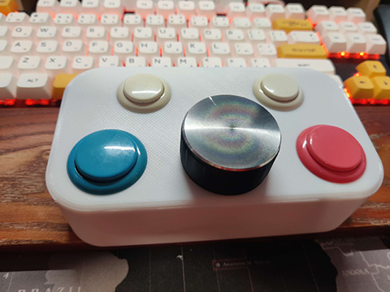

# Arduino_ArcadeSpinner

This project is a modern re-creation of the spinners used in arcades, mainly for brick-breakers like arkanoid for example.

The objective is to offer a feeling close to the original equipment by using components that are easy to obtain.




## Usage

By default the device operate as a 4 button controller with Spinner/Paddle attached

You can activate an additional behavior by holding a button when you plug in the device : 

- Press Button0 (Big Left button) to enable MouseX Emulation
- Press Button1 (Big Right button) to enable Paddle Emulation
- Press Button2 (Small Left button) to switch device to mr.Spinner (enabling composite device on mister fpga)

## MisterFPGA

### Working

| Game                          | Note|
|---                            |---| 
| Arkanoid (World)              | |
| Block Gal                     | |
| Breakout (TTL)                | Enable spinner in controls|
| Crater Raider                 | |
| Dark Planet                   | |
| Demolition Derby              | |
| Discs of Tron                 | |
| Eco Fighters                  | Use mr.Spinner mode |
| Forgotten Worlds              | Use mr.Spinner mode |
| Kick                          | |
| Kozmik Krooz'r                | |
| Midnight Resistance           | Use mr.Spinner mode |
| Moonwar                       | |
| Puzz Loop 2                   | Enable Paddle in Service mode (System -> Operation) |
| Tron                          | |
| Two Tigers (tron conversion)  | |

### Working with workaround
| Game                  | Note|
|---                    |---| 
| Block block (world)   | Use alternatives/block block (world 910910), must use Mouse Emulation |
| Super Breakout        | Enable paddle in controls, must use paddle emulation |

### Not Working

| Game                      | Note|
|---                        |---| 
| Heavy Barrel              | LS-30 joystick |
| Ikari Warriors            | LS-30 joystick |
| Mad Planets               | LS-30 joystick |
| SAR - Search and Rescue   | LS-30 joystick |
| SNK - T.N.K. III          | LS-30 joystick |
| Time Soldiers             | LS-30 joystick |
| Victory                   | LS-30 joystick |
| Victory Road              | LS-30 joystick |

## Build yourself

### Parts 

- Rotary encoder (Model: C38S6G5-600B-G24N)
- 40mm Knob with internal diameter of 6mm 
- Arduino Pro Micro
- 2 24mm button
- 2 30mm button
- Enclosure 3D printed or any box

#### Prepare the rotary encoder

1. Remove the metal enclosure and extract the mechanism.
2. Unsolder all wires.
3. Solder fresh wires on GND, VCC, A and B pads.
4. Recycle the original metal case and wire for another project.

### Arduino Pinout

The buttons must be grounded, you can create a daisy chain to use a common GND for your 4 buttons, you can solder the buttons or use wire connectors.

```
Encoder
GND     GND
VCC     VCC
GP_3    A
GP_2    B

Buttons
GP_5    Button0
GP_4    Button1
GP_15   Button2
GP_14   Button3
```

### Flash your Arduino

1. Install Aduino IDE 2.x
2. Open Arduino_ArcadeSpinner.ino
    1. (Optionnal) Change options in the configuration section.
3. Connect your Arduino pro micro to your computer
4. Select Arduino Leonardo with the correct com port
5. Flash the controller

## Technical informations
In the mister source code there is two special cases

If the device name start by MiSTer-S1 the device is considered as a mr.Spinner

```
// mr.Spinner
// 0x120  - Button
// Axis 7 - EV_REL is spinner
// Axis 8 - EV_ABS is Paddle
// Overlays on other existing gamepads
if (strstr(uniq, "MiSTer-S1")) input[n].quirk = QUIRK_PDSP;
if (strstr(input[n].name, "MiSTer-S1")) input[n].quirk = QUIRK_PDSP;
```

If the device name start by MiSTer-A1 the device is considered as an arcade stick with a spinner and/or paddle
```
// Arcade with spinner and/or paddle:
// Axis 7 - EV_REL is spinner
// Axis 8 - EV_ABS is Paddle
// Includes other buttons and axes, works as a full featured gamepad.
if (strstr(uniq, "MiSTer-A1")) input[n].quirk = QUIRK_PDSP_ARCADE;
if (strstr(input[n].name, "MiSTer-A1")) input[n].quirk = QUIRK_PDSP_ARCADE;
```